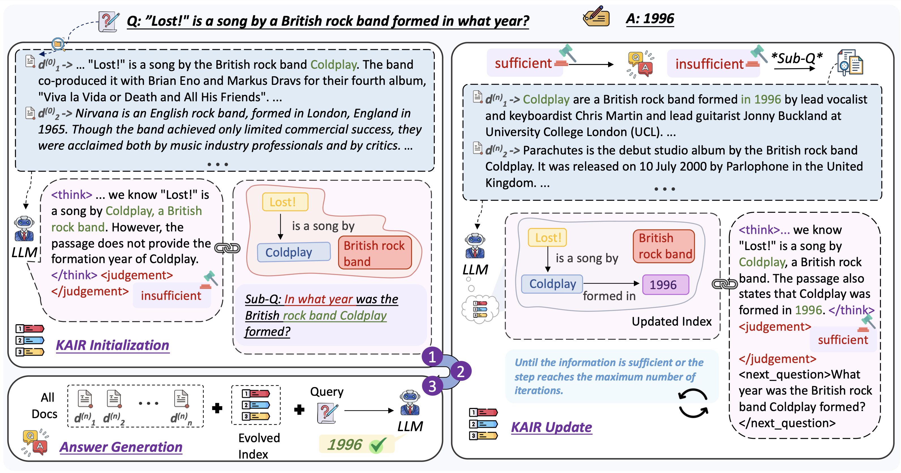

# Finding What Matters: Anchoring Context Knowledge with Evolving Indices for Iterative Retrieval
<!-- Source code for our paper:\
[Graph-Anchored Knowledge Indexing for Retrieval-Augmented Generation](https://www.arxiv.org/pdf/2601.16462)

Click the link below to view our papers:

<a href='https://www.arxiv.org/pdf/2601.16462'></a>

If you find this work useful, please cite our paper and give us a shining star 🌟
```
@article{liu2026graphanchoredknowledgeindexingretrievalaugmented,
      title={Graph-Anchored Knowledge Indexing for Retrieval-Augmented Generation}, 
      author={Zhenghao Liu and Mingyan Wu and Xinze Li and Yukun Yan and Shuo Wang and Cheng Yang and Minghe Yu and Zheni Zeng and Maosong Sun},
      year={2026},
      eprint={2601.16462},
      archivePrefix={arXiv},
      primaryClass={cs.CL},
      url={https://arxiv.org/abs/2601.16462}, 
}
``` -->

## Overview

KAIR is a Knowledge Anchoring framework for Iterative Retrieval that anchors knowledge within retrieved knowledge to guide LLMs to locate the key information. During iterative retrieval, KAIR progressively updates the knowledge index to anchor salient evidence from retrieved documents. The evolving index serves as a navigational anchoring index that enables the LLM to assess knowledge sufficiency and formulate subsequent retrieval queries. Finally, KAIR generates answers by jointly leveraging the retrieved documents and the finalized anchoring index.

## Set Up
**Use `git clone` to download this project**
```
git clone https://github.com/NEUIR/KAIR.git
cd KAIR
```

**use the virtual environment management packages**

```
conda env create -n KAIR -f kair_environment.yml
```

## Prepare Datasets
**Our code and data are developed based on [DeepNote](https://github.com/thunlp/DeepNote).**
### 1 Download the data
Follow the DeepNote's instruction to prepare the datasets:\
All corpus and evaluation files should be placed in the `/data` directory. You can download the experimental data (MuSiQue, HotpotQA, 2WikiMultihopqa) [here](https://drive.google.com/drive/folders/1NeEm-r7l43MQxGS1n7jJ8tPvltgcaPjY?usp=sharing). \
And you can download Bamboogle data [here](https://huggingface.co/datasets/chiayewken/bamboogle). For Bamboogle dataset, we use the same corpus as HotpotQA dataset.

### 2 Build Indices 
For HotpotQA, 2WikiMQA, and MusiQue
```bash
cd src/build_index/emb
python index.py --dataset hotpotqa --model bge-base-en-v1.5 # e.g., for HotpotQA dataset
```

## Configuration

You can configure the model path in the `./config/config.yaml` file.

## Running KAIR and Evaluation

```bash
python KAIR.py --method KAIR --retrieve_top_k 5 --dataset hotpotqa --max_step 3 --model qwen2.5-7b-instruct 
```
❗️Note: max_step should be set to the maximum number of retrieval steps minus one.\
The predicted results and evaluation metrics will be automatically saved in the `output/{dataset}/` directory. The evaluation results can be found at the end of the file.

## Contact
If you have questions, suggestions, and bug reports, please email:
```
2401930@stu.neu.edu.cn 
```